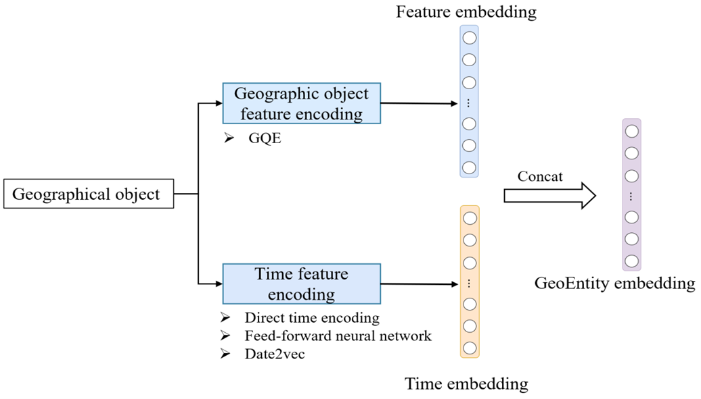
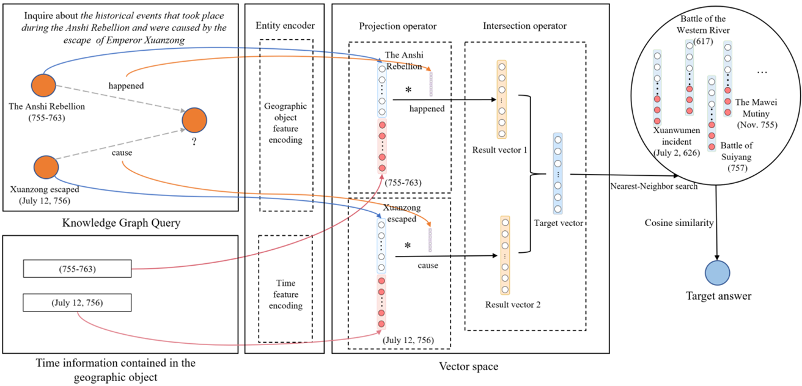

# Eliminating Semantic Bias of Geographic Objects in Geographic Query Tasks Using Temporal Embedding Enhancing Methods

This project introduces the Temporal Feature Knowledge Graph Embedding (TFKGE) model, which integrates temporal data to effectively eliminate semantic bias in geographic knowledge graph queries, enhancing accuracy in geographic query tasks.

## Model Architecture and Example

### Model Architecture

<p align="center">
  
</p>

### Example Query Process



## Installation

To install the required environment, run:

```bash
pip install -r requirements.txt
```

## Running the Code

This code includes six models: `cga`, `gqe`, `gqe-diag`, `time_direct_encode`, `time_forward_NN`, and `time2vec`. Parameter files for each model are provided and stored in `xxxx.sh`.

1. Navigate to the `./tfkge/netquery/yagotime/` directory and configure the parameters according to the `.sh` file before running.
2. Alternatively, you can simply double-click the `.sh` file to run it.


## References

1. The Date2vec source code is modified from [Date2Vec](https://github.com/ojus1/Date2Vec).
2. The code in this article is based on [sekge](https://github.com/gengchenmai/se-kge) and [kge](https://github.com/williamleif/graphqembed).
3. The dataset is sourced from [mmkb](https://github.com/mniepert/mmkb).